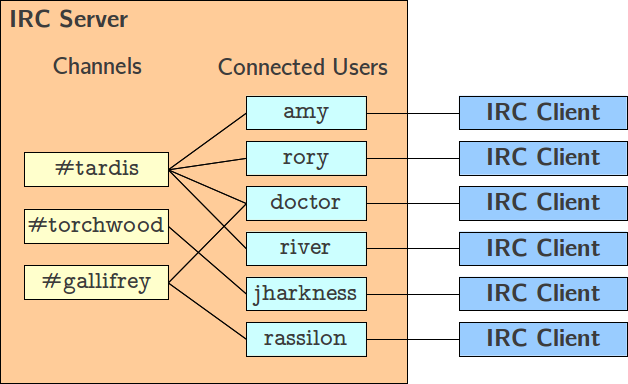

*This project has been created as part of the 42 curriculum by kaisuzuk, ketomita.*

# Description
ft_ircは、C++98で実装したIRCサーバーです。

このプロジェクトの目的は、IRCプロトコルの仕様を読み解きながら、ソケット通信・I/O多重化・ネットワークプログラミングの理解を深めることです。
標準的なIRCクライアントで実際に接続・動作確認ができます。
本プロジェクトでは、ncコマンドで動作確認を行いました。

## IRCとは

IRC(Internet Relay Chat)は、1988年に開発されたテキストベースのリアルタイム通信プロトコルです。サーバーにクライアントが接続し、チャンネルと呼ばれる部屋を通じてグループチャットや個人間のメッセージ交換ができます。

 <br>
*画像出典: [Internet Relay Chat — The UChicago χ-Projects](http://chi.cs.uchicago.edu/chirc/irc.html)*

チャンネルは参加者がいる限り存在し、最初に参加したクライアントがオペレータとなります。
オペレーターはチャンネルの所有者とみなされ、以下のような操作が可能です。
- 参加者のチャンネルからの追放(KICK)
- チャンネルのモード変更(MODE)
- 他のクライアントへのオペレーター権限付与

1つのメッセージは、最大512文字の文字列です。メッセージの区切りはCR-LF（キャリッジリターン - ラインフィード）ペア（つまり「\r\n」）で示されます。
512文字の制限にはこの区切り文字も含まれるため、メッセージには510文字分の有効なスペースしかありません
メッセージは、コマンドとコマンドパラメータの2つの部分で構成されます。
コマンドとパラメータはすべて、1つのASCIIスペース文字で区切られます。
以下は有効なIRCメッセージの例です。

```text
NICK amy

JOIN #tradis

MODE amy +o
```

最後のパラメータの先頭にコロン文字が付いている場合、そのパラメータの値はメッセージの残りの部分（スペース文字を含む）になります。つまり一つのパラメータとして処理されます。
```text
PRIVMSG roy :hey Rory...

PRIVMSG #cmsc23300 :Hello everybody

QUIT :Done for the day, leaving
```


## ソケット
インターネットはTCP/IPと呼ぶ通信プロトコルを利用しますが、そのTCP/IPをプログラムから利用するには、プログラムの世界とTCP/IPの世界を結ぶ特別な出入り口が必要となります。その出入り口となるのがソケット (Socket)です。

ソケットを介してデータを送受信するときには、ファイルの入出力と同じ要領で行うことができます。つまり送信したいデータをソケットに書き込むと、通信相手のコンピューターのソケットに届きます。また、受信はソケットからデータを読み出します。データの送受信はOSが担当します。


### ソケットの種類
``` text
SOCK_STREAM     -> TCP(信頼性あり・順番保証・コネクション型)
SOCK_DGRAM      -> UDP(信頼性なし・順番保証なし・コネクションレス)
```

### サーバー側の流れ
```bash
# 1. ソケット作成
int fd = socket(AF_INET, SOCK_STREAM, 0);

# 2. ソケットに名前をつける(ポートに紐付け)
## addrにポートなどを設定
bind(fd, (struct sockaddr*) &addr, sizeof(addr));

# 3. 接続待機開始
listen(fd, 10);

# 4. 接続受け入れ
int client_fd = accept(fd, (struct sockaddr*)&client_addr, &len);

# 5. データ送受信
recv(client_fd, buf, sizeof(buf), 0);
send(client_fd, buf, len, 0);

# 6. 切断
close(client_fd);
```

### クライアント側の流れ
```bash
# 1. ソケット作成
int fd = socket(AF_INET, SOCK_STREAM, 0);

# 2. サーバーに接続
connect(fd, (struct sockaddr*)&addr, sizeof(addr));

# 3. データ送受信
send(fd, buf, len, 0);
recv(fd, buf, sizeof(buf, 0));

# 4. 切断
close(fd);
```

## ノンブロッキング

通常のブロッキングI/Oでは、`read`や`write`などのシステムコールを呼び出すと、処理が完了するまでプログラムの実行が止まります。例えば、クライアントからのデータを待っている間、他のクライアントの処理が一切できなくなります。
ノンブロッキングI/Oでは、システムコールは処理をブロックすることなく、すぐに返ってきます。そのため、データがきていない場合でも他の処理を続けることができます。これにより、1つのプロセスで複数のクライアントを同時に処理することが可能になります。

しかし、ノンブロッキングI/Oを単純なループで実装することは、通常期待通りには機能しません。
ループの間隔を長くすれば、アプリケーションがI/Oイベントに反応するのが遅れることになり、その時間差が許容できない場合もあります。逆にループの間隔を短くすると、ビジーウェイト状態になります。これはCPUリソースを無駄に消費するため、効率的ではありません。<br>
この問題を解決するのが多重I/Oです。


## 多重I/O

多重I/Oでは、複数のファイルディスクリプ他を指定し、そのうちの一部でもI/Oが可能になったか否かを監視できます。これにより、処理がブロックすることはなく、I/Oが可能になったものだけを処理することができます。ビジーウェイトを避けながら、複数のクライアントを効率的に処理できます。

多重I/Oは、本質的に同機能の2種類のシステムコールにより実現できます。`select`と`poll`です。それに加え、Linux専用の`epoll`があります。それぞれのシステムコールには、以下のような特徴があります。

### select
```bash
int select(int nfds, fd_set *readfds, fd_set *writefds,
           fd_set *exceptfds, struct timeval *timeout);
```
- fd_set(ビットセット)を用いて管理する。
- 監視対象ファイルディスクリプタ数に上限がある。
- fd_setに監視対象ファフィルディスクリプタを指定して呼び出す。リターン時にはfd_setの内容が変更され、I/O可能と判定したファイルディスクリプタのみが残された状態になる。これにより、ループで繰り返し実行する場合は、毎回再初期化する必要がある。
- 結果を確認するために、fdを全探索する必要がある。

### poll
```bash
int poll(struct pollfd *fds, nfds_t nfds, int timeout);

struct pollfd {
    int   fd;         /* file descriptor */
    short events;     /* requested events */
    short revents;    /* returned events */
};
```
- 構造体を使って管理する。eventを通知したら、構造体のメンバ(revents)にビットをセットする。
- 監視対象ファイルディスクリプタ数に上限はない。
- 結果を確認するために、構造体を全探索する必要がある。

### epoll
```bash
int epoll_create1(int flags);
int epoll_ctl(int epfd, int op, int fd, struct epoll_event *event);
int epoll_wait(int epfd, struct epoll_event *events,
               int maxevents, int timeout);
```
- 監視対象ファイルディスクリプタ数に上限はない。
- eventが発生したfdの返るため、全探索する必要がない。
- epoll_create1でインスタンスを作成し、epoll_ctlで監視するfdを登録・変更・削除する。epoll_waitでイベント発生までブロックする。
- Linux専用

以上の特徴から、`select`と`poll`では監視対象ファイルディスクリプタが増加すると効率よくスケールしません。
そのため、本プロジェクトでは`epoll`を採用しました。

## アーキテクチャ

|クラス|役割|
|-----|-----|
|`FtIRCd`|サーバー全体を管理する|
|`SocketEngine`|`epoll`をラップしたI/O多重化エンジン|
|`Client`|接続中のクライアントの情報を保持する|
|`ClientManager`|接続クライアントをファイルディスクリプ他で管理する|
|`Channel`|チャンネルの情報と、その参加者を保持する|
|`ChannelManager`|チャンネルの作成・削除・参加者を管理する|
|`CommandParser`|クライアントから受け取ったメッセージを解析し、対応するコマンドに振り分ける|
|`ACommand`(+各サブクラス)|各IRCコマンドを実装したクラス群|
|`NumericReply`|サーバーからクライアントへの数値リプライを定義|

## 対応コマンド

|カテゴリ|コマンド|
|----------|----------|
|接続|`PASS` `NICK` `USER` `QUIT`|
|チャンネル|`JOIN` `PART` `KICK` `INVITE` `TOPIC` `LIST` `NAMES`|
|メッセージ|`PRIVMSG` `NOTICE`|
|モード|`MODE` (`+i`, `+t`, `+k`, `+l`, `+n`, `+o`)|
|サーバー|`MOTD`|

# Instructions

## インストール
```bash
git clone <project>
```

## コンパイル
``` bash
make            # ビルド
make clean      # オブジェクトファイルの削除
make fclean     # バイナリも含めて削除
make re         # 再ビルド
```

## 実行
```bash
./ircserv <port> <password>
```
|引数|説明|
|-----|-----|
|port|待ち受けるポート番号(1024 - 65535)|
|password|クライアントが接続時に使用するパスワード|

## 接続
```bash
nc -NC localhost <port>
```

# Resources

## Books
- [TCP/IPソケットプログラミング　C言語編](https://www.ohmsha.co.jp/book/9784274065194/)
- [UNIXネットワークプログラミング Vol.1](https://www.amazon.co.jp/UNIX%E3%83%8D%E3%83%83%E3%83%88%E3%83%AF%E3%83%BC%E3%82%AF%E3%83%97%E3%83%AD%E3%82%B0%E3%83%A9%E3%83%9F%E3%83%B3%E3%82%B0%E3%80%88Vol-1%E3%80%89%E3%83%8D%E3%83%83%E3%83%88%E3%83%AF%E3%83%BC%E3%82%AFAPI-%E3%82%BD%E3%82%B1%E3%83%83%E3%83%88%E3%81%A8XTI-W-%E3%83%AA%E3%83%81%E3%83%A3%E3%83%BC%E3%83%89-%E3%82%B9%E3%83%86%E3%82%A3%E3%83%BC%E3%83%B4%E3%83%B3%E3%82%B9/dp/4894712059)
- [Linuxプログラミングインタフェース](https://www.oreilly.co.jp/books/9784873115856/)

## Web
- [Internet Relay Chat — The UChicago χ-Projects](http://chi.cs.uchicago.edu/chirc/irc.html)

## RFC
- [RFC 1459](https://datatracker.ietf.org/doc/html/rfc1459)
- [RFC 2811](https://datatracker.ietf.org/doc/html/rfc2811)
- [RFC 2812](https://datatracker.ietf.org/doc/html/rfc2812)

## IRC
- [inspircd](https://www.inspircd.org/)

## AI
- RFCの翻訳
- inspircdのソースコード読解サポート
- クラス設計のサポート
- epoll・poll・selectなどI/O多重化とノンブロッキングに関する概念理解のための壁打ち
- テスト項目の洗い出しとpythonの文法
- READMEの翻訳

# Command Reference

## 接続登録
|コマンド|パラメーター|説明|
|-----|-----|-----|
|`PASS`|\<password\>|サーバーへの接続パスワードを送信する。|
|`NICK`|\<nickname\>|ユーザーにニックネームをつけるか、既存のニックネームを変更するために使用される。ニックネームは重複できない。|
|`USER`|\<user\> \<mode\> \<unused\> <\realname\>|接続時にユーザー情報を登録する。NICKと合わせて使用することで、接続登録が完了する。modeパラメータはユーザーモードを設定するためのものであり、本プロジェクトでは実装していない。|
|`QUIT`|(\<Quit Message\>)|サーバーとの接続を切断する。メッセージを指定するとその内容が切断メッセージとして表示される。|

## チャンネル操作
|コマンド|パラメーター|説明|
|-----|-----|-----|
|`JOIN`|\<channel\> (\<key\>)|指定したチャンネルに参加する。チャンネルが存在しない場合は新規作成される。キーが設定されているチャンネルではキーが必要。|
|`PART`|\<channel\> (\<Part Message\>)|指定したチャンネルから退出する。メッセージを指定するとその内容が退出メッセージとして表示される。|
|`MODE`|\<channel\> ((+/-)\<mode\> \<modeparams\>)|チャンネルのモードを設定する。パラメータがchannelのみの場合、そのチャンネルの現在のモードが表示される。以下のモードが使用できる。<br> `+i`: 招待制チャンネルに設定する <br> `+t`: TOPICの変更をオペレーターのみに制限する <br> `+k`: チャンネルにパスワードを設定する <br> `+l`: チャンネルの最大人数を設定する <br> `+n`: チャンネル外からのメッセージを禁止する <br> `+o`: 指定したユーザーにオペレーター権限を付与する|
|`TOPIC`|\<channel\> (\<topic\>)|チャンネルのトピックを設定する。トピックを指定しない場合は現在のトピックが表示される。|
|`NAMES`|\<channel\>|指定したチャンネルに参加しているユーザーの一覧を表示する。|
|`LIST`|(\<channel\>)|チャンネルの一覧を表示する。チャンネルを指定した場合はそのチャンネルの情報のみ表示される。|
|`INVITE`|\<nickname\> \<channel\>|指定したユーザーをチャンネルに招待する。招待制チャンネル(+i)の場合はオペレーター権限が必要。|
|`KICK`|\<channel\> \<nickname\> (\<comment\>)|指定したユーザーをチャンネルから強制退出させる。オペレータ権限が必要。|

## メッセージの送信
|コマンド|パラメーター|説明|
|-----|-----|-----|
|`PRIVMSG`|\<msgtarget\> \<text to be sent\>|指定したユーザーまたはチャンネルにメッセージを送信する。|
|`NOTICE`|\<msgtarget\> \<text to be sent\>|指定したユーザーまたはチャンネルにメッセージを送信する。PRIVMSGとは異なり、自動返信を生成しない。|

## サービスクエリとコマンド
|コマンド|パラメーター|説明|
|-----|-----|-----|
|`MOTD`| - |サーバーのメッセージを表示する。|


# Tester
[command tester](https://github.com/kaisuzuk2/42-ft_irc_tester)

## インストール

```bash
git clone https://github.com/kaisuzuk2/42-ft_irc_tester.git
```

## 必要なもの

- python3

## 実行方法
- 別のターミナルでサーバーを起動してから実行してください。

```bash
python3 tester/tester.py
```